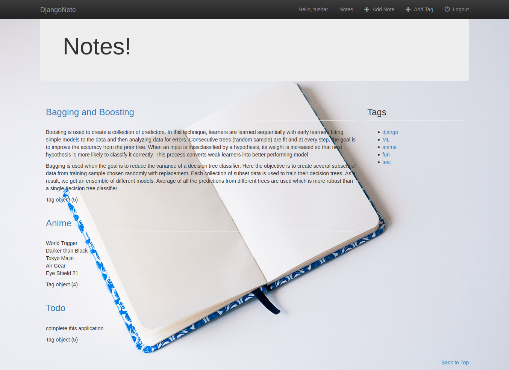

# Djangonote

- Djangonote is a note keeping web application based on django as the name suggests.

- This application has functionalities of adding notes, editing them, creating tags, adding tags with the notes.

- We can also search the notes with the specific tags by clicking on the tag itself. It will show the notes associated with that tag.

## Setting Up

1. clone the repository `git clone https://github.com/tbhal/djangonote.git`

1. Switch to the directory.

1. Install the dependecies mentioned in requirements.txt file using `pip install -r requirements.txt`

1. After this it's time to run the server. Run it using `python manage.py runserver`

## Results

**Login Page**

**Register**

**Authentication message if user is not valid**

**Basic Layout**

**Add Note**

**Add Tag**

**Search using Tag**

# TO DO
- [X] add note button working
- [X] add images of working
- [ ] add functionality to add images in notes

**Thanks to @souldeux and thenewboston for their tutorials I completed it with their help you can checkout their tutorials [here](https://www.youtube.com/playlist?list=PL6gx4Cwl9DGBlmzzFcLgDhKTTfNLfX1IK) and [here](https://souldeux.com/blog/django-note-app-tutorial-part-1-layout-file-structure/)**
